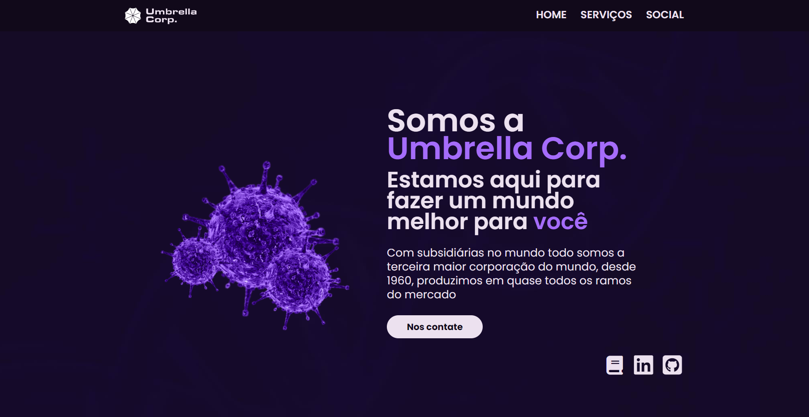
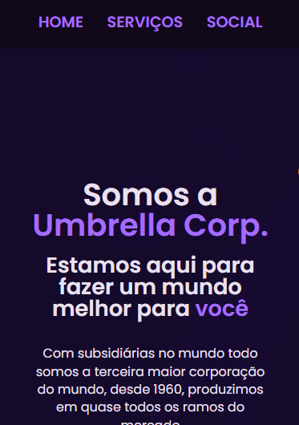

# Umbrella Corp - Landing page 
### Landing page de um conglomerado com laboratório, indústrias, produção de químicos e navegação transatlântica.
 
- Home: Seção inicial com título, breve descrição, botões de contato e menu para navegar entre seções

- Services: Cartões com informações sobre serviços prestados

- Rate/Comments: Comentários de clientes e prêmios ganhos pela empresa

---

---

# Processo

## Design
### Design e layout feito usando pacote Adobe 

1 - Obter referência e layout

2 - Escolher tema e obter assets

3 - Escolher cores

---

## Planejamento

1 - Fazer desenho de caixas (grid-flex) antes de escrever qualquer código, definindo quais elementos serão usados (desenho no PDF abaixo)

### Aqui há um PDF com todos os assets, design, planejamento e referência de layout

([umbrella-corp-designs](https://drive.google.com/drive/folders/1_M_VjF6c6kmJzV0o1e3lQqF5baozrlpc?usp=sharing))

---

# Aprendizados

### Trabalho com responsividade 
- Nesse projeto foram usados varios pontos de quebra (breakpoints), na maoria mudando bastante coisa entre cada ponto como o seção dos serviços

---

### Reduzir tamanho (MB) das imagens
- Comprimi todas as imagens do projetos, cuidei do tamanho antes de começar o projeto, para não precisar trocar depois de terminar o código, tive essa experiência no projeto passado

---

# Tecnologias utilizadas
- HTML5 Markup 
- CSS
- Clean Code
- Photoshop
- Illustrator

# Autor
### Jefferson Augusto (a.k.a Benssssss) 
## [LinkedIn](https://www.linkedin.com/in/benssssss/)

## Projeto n.º10
